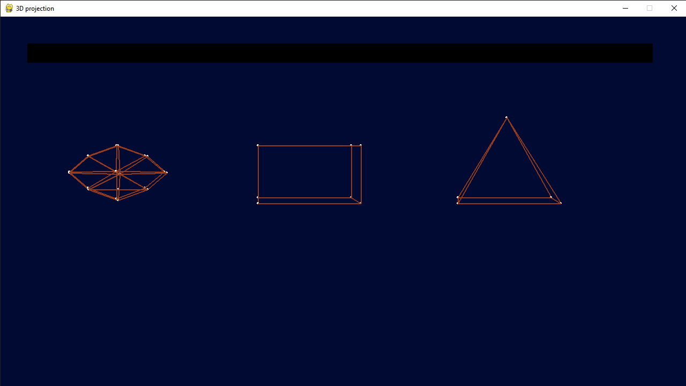

# Perspective projection

## How it works?
In my project I used 5 functions: 
- [2D to 3D conversion](https://github.com/Jjponvv/Perspective-Projection/tree/main?tab=readme-ov-file#2d-to-3d-conversion)
- [rotate x, y, z](https://github.com/Jjponvv/Perspective-Projection/tree/main?tab=readme-ov-file#rotating-x-y-and-z)
- [drawing](https://github.com/Jjponvv/Perspective-Projection/tree/main?tab=readme-ov-file#drawing)

## 2D to 3D conversion

For this function I used this formula:

`x / (z * tan(angle / 2))`  
Where:  
**x** - cordinate (I can use **y** also)  
**z** - z cordinate  
**angle** - it's a field of view (**FOV**)

**tan()** function is tangent

## rotating (**x**, **y** and **z**)

To rotate shapes in 3D space, I used a **rotation matrix**  

**θ** - How much angle do we turn  
**sin** and **cos** - sine and cosine

By multiplying the coordinate matrix [x, y, z] (1 by 3) I get the values ​​that I use in the drawing

## Drawing
In this function I check which button was pressed and use the rotation functions according to the button.  
Next, I first draw the vertices and then the edges of the shapes.  
The rendering function is in an infinite loop, so it updates endlessly.

### You can rotate shapes and create your own using vertex lists
